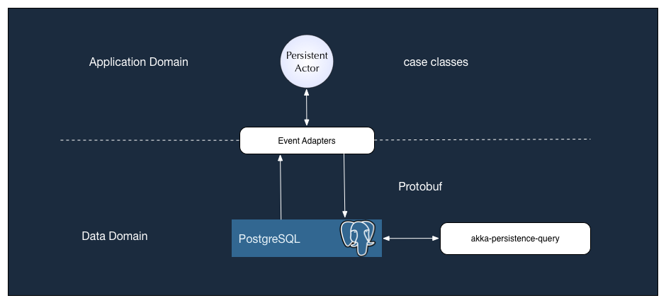

# akka-serialization-test

[](https://travis-ci.org/dnvriend/akka-serialization-test)
[](https://gitter.im/dnvriend/akka-serialization-test?utm_source=badge&utm_medium=badge&utm_campaign=pr-badge&utm_content=badge)
[](http://www.apache.org/licenses/LICENSE-2.0.txt)

Study on [akka-serialization][ser] using [Google Protocol Buffers][pb], [Kryo][kryo] and [Avro][avro]

## TL;DR
Define domain command and events messages in the companion object of the `PersistentActor` using DDD concepts.
Configure the serialization library you wish to use. Register the serializer to use 
in `application.conf` in the path `akka.actor.serializers` and register the classes to bind to a certain serializer in the path `akka.actor.serialization-bindings`. When the serializer and bindings have been configured, Akka serialization will transparently serialize/deserialize messages.

## Overview
[Akka serialization][ser] is a good way for domain messages like commands and events to be serialized to a format of choice. In this example, the domain messages are defined in the companion object of the `Person` which is an `PersistentActor`. The actor handles commands like `RegisterNameCommand`, `ChangeNameCommand` and `ChangeSurnameCommand`, and stores events like `NameRegistedEvent`, `NameChangedEvent` and `SurnameChangedEvent` to persistent storage. The serialization method and the details of the persistent storage is unknown to the `PersistentActor` which is a good thing.

In the example below, three serializers are registered, one for Google's Protocol buffers format, which comes out of the box when you add `akka-remote` to your project, one for kryo and a custom Json serializer.

```
akka {
    actor {
            serializers {
                proto = "akka.remote.serialization.ProtobufSerializer"
                kryo = "com.twitter.chill.akka.AkkaSerializer"
                json = "com.github.dnvriend.serializer.json.JsonSerializer"
            }
    }
}
```

Also, the serialization-binding, which domain class will be handled by which serializer are registered in `application.conf`. In the example below, all `com.google.protobuf.Message` classes will be handled by the Akka ProtobufSerializer, all `Pet` related messages will be handled by Kryo and all `Order` related messages will be handled by our custom Json serializer. 

```
akka {
    actor {
            serialization-bindings {
                "com.google.protobuf.Message" = proto
                "com.github.dnvriend.domain.PetDomain$Pet" = kryo
                "com.github.dnvriend.domain.OrderDomain$Order" = json
            }
    }
}
```

Message serialization is the responsibility of akka, how great is that! When no serialization binding can be found 
to a certain message, the default `akka.serialization.JavaSerializer` will be used, which may or may not be a good thing.

All serializers are responsible for turning an object into an `Array[Byte]` (serializing) and an `Array[Byte]` 
into an object (deserializing). Its the responsibility of the serializer to choose an appropriate method for 
serialization. For example, the domain message may be converted to a String representation, eg. CSV, XML or JSON, 
afterwards the formatted string must be converted to an `Array[Byte]`, because that must be the return type of the 
serializer when it marshals an object.

The serializer can also be used to convert an `Array[Byte]` into an object (deserialization). The serializer has all 
the knowledge to interpret the `Array[Byte]`. When the `Array[Byte]` is actually a CSV, the array must first be 
converted into a string, then the fields must be parsed, and then an object must be created, because the serializer 
must return an `AnyRef` type when it serializes the `Array[Byte]`.

## Event Adapters
Event adapters are the bridge between the domain model and the data model. When an actor persists messages to the data store, the event adapter is responsible for converting the message from the application model (mostly case classes) and the data model, which could be a Protobuf binding class that has been generated from a `.proto` IDL file for example. These classes all extend the `com.google.protobuf.Message` class, and as such will be serialized using the built-in Akka Protobuf serializer. 

Other strategies are possible as well, just convert the domain class to the format the serializer expects and the serializer will do the rest. 

One thing to note, and made visual in the image below is that the event adapter is only doing work for the persistent actor. When using the new `akka-persistence-query` api, the event adapters will __not__ be used. Be sure that your application can work with the domain model that has been stored in the journal. For example, when using Protobuf, akka-persistence-query will emit a stream of `EventEnvelope` classes that will contain a `com.google.protobuf.Message` message as the payload; the application should be able to convert this generic protobuf object to a Protobuf binding class that can interpret what the bytes mean. 

When you use other strategies for storing messages in the journal, the bytes could mean JSON, Kryo or whatever data model you use. 



## Google Protocol Buffers


## ScalaPB ##


# Kryo, Twitter Chill and Akka
[Kryo][kryo] is a fast and efficient object graph serialization framework for Java. The goals of the project are speed, 
efficiency, and an easy to use API. The project is useful any time objects need to be persisted, whether to a file, database, 
or over the network. To be able to use Kryo effectively on [Scala][scala], I will be using [Twitter's Chill][chill] which provides 
extensions for the [Kryo][kryo] serialization library including serializers and a set of classes to ease configuration of 
[Kryo][kryo] in systems like [Hadoop][hadoop], [Storm][storm], [Akka][akka] and is available on [maven-central][chill-maven-central].
 
## Kryo Akka Serialization
[Chill][chill] provides a [Kryo Akka Serializer][chill-akka] out of the box.

## Apache Avro
[Avro][avro-wiki] is a remote procedure call and data serialization framework developed within Apache's Hadoop project. 
It uses JSON for defining data types and protocols, and serializes data in a compact binary format. Its primary use is 
in Apache Hadoop, where it can provide both a serialization format for persistent data, and a wire format for communication 
between Hadoop nodes, and from client programs to the Hadoop services.

It is similar to [Thrift][thrift-wiki], but does not require running a code-generation program when a schema changes 
(unless desired for statically-typed languages).

We will be using [Stephen Samuel's][sksamuel] (also known for [Elastic4s][elastic4s], a non-blocking, type safe DSL and Scala client for Elasticsearch),
[Avro4s][avro4s] project, which is a schema/class generation and serializing/deserializing library for Avro written in Scala. The objective of [Avro4s][avro4s] 
is to allow seamless use with Scala without the need to to write boilerplate conversions yourself, and without the runtime overhead of reflection. 
Hence, this is a _macro based_ library and generates code for use with Avro at compile time.

## Apache Thrift
_not yet available_

# What's new?
## 1.0.3 (2016-06-19)
  - Merged PE #5 [Giampaolo Trapasso][trapasso] Avro schema evolution 2, thanks!

## 1.0.2 (2016-06-16)
  - Merged PE #4 [Giampaolo Trapasso][trapasso] Avro schema evolution, thanks!

## 1.0.1 (2016-06-08)
  - Merged PR #1 [Giampaolo Trapasso][trapasso] Added Apache Avro serialization example, thanks!

## 1.0.0 (2016-06-07)
  - Added Kryo serialization example

Have fun!

[trapasso]: https://github.com/giampaolotrapasso
[sksamuel]: https://github.com/sksamuel

[akka]: http://akka.io/
[hadoop]: http://hadoop.apache.org/
[storm]: http://storm.apache.org/
[ser]: http://doc.akka.io/docs/akka/current/scala/serialization.html
[pb]: https://developers.google.com/protocol-buffers/docs/overview
[scalapb-github]: https://github.com/trueaccord/ScalaPB
[scalapb]: http://trueaccord.github.io/ScalaPB/
[scalapb-sbt]: http://trueaccord.github.io/ScalaPB/sbt-settings.html
[kryo]: https://github.com/EsotericSoftware/kryo
[scala]: http://www.scala-lang.org/
[chill]: https://github.com/twitter/chill
[chill-akka]: https://github.com/twitter/chill#chill-akka
[chill-maven-central]: http://search.maven.org/#search%7Cgav%7C1%7Cg%3A%22com.twitter%22%20AND%20a%3A%22chill-akka_2.11%22
[avro]: https://avro.apache.org/
[avro-wiki]: https://en.wikipedia.org/wiki/Apache_Avro
[avro4s]: https://github.com/sksamuel/avro4s
[elastic4s]: https://github.com/sksamuel/elastic4s
[thrift-wiki]: https://en.wikipedia.org/wiki/Apache_Thrift

[nadav-samet-working-protobuf]: https://www.youtube.com/watch?v=cQdMyjHjbn8
